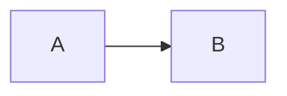
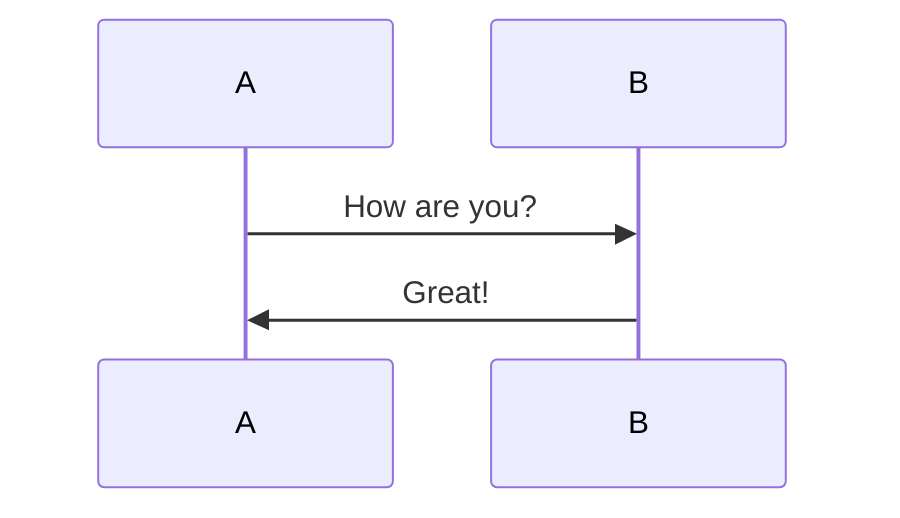

---
# type: docs 
title: Markdown语法大全(超级版)
date: 2024-07-05T11:34:47+08:00
featured: false
draft: false
comment: true
toc: true
reward: true
pinned: false
carousel: false
series:
  - HelpDocs
categories:
tags: 
  - HelpDocs
  - Markdown
authors:
  - CSDN_user
images: []
--- 

Markdown语法大全(超级版)
-----------------

CSDN的参考文档并不全……  
  

#### 文章目录

- [Markdown语法大全(超级版)](#markdown语法大全超级版)
    - [文章目录](#文章目录)
  - [概述](#概述)
    - [设计理念](#设计理念)
    - [内联 HTML 语法](#内联-html-语法)
    - [特殊字符自动转义](#特殊字符自动转义)
  - [行内语法讲解](#行内语法讲解)
    - [注释的表述](#注释的表述)
      - [代码法](#代码法)
      - [html注释](#html注释)
      - [hack方法](#hack方法)
    - [分级标题、任务列表](#分级标题任务列表)
      - [分级标题](#分级标题)
      - [任务列表](#任务列表)
    - [缩进、换行、空行、对齐方式](#缩进换行空行对齐方式)
      - [首行缩进](#首行缩进)
      - [换行](#换行)
      - [空行](#空行)
    - [斜体、粗体、删除线、下划线、背景高亮](#斜体粗体删除线下划线背景高亮)
    - [超链接、页内链接、自动链接、注脚](#超链接页内链接自动链接注脚)
      - [行内式](#行内式)
      - [参考式](#参考式)
      - [脚注](#脚注)
      - [锚点（页内超链接）](#锚点页内超链接)
      - [自动链接](#自动链接)
    - [无序列表、有序列表、定义型列表](#无序列表有序列表定义型列表)
      - [无序列表](#无序列表)
      - [有序列表](#有序列表)
      - [定义型列表](#定义型列表)
    - [插入图像](#插入图像)
    - [多级引用](#多级引用)
    - [转义字符、字体、字号、颜色](#转义字符字体字号颜色)
    - [转义字符](#转义字符)
  - [块语法讲解](#块语法讲解)
    - [内容目录](#内容目录)
    - [代码块](#代码块)
      - [行内式](#行内式-1)
    - [缩进式多行代码](#缩进式多行代码)
    - [流程图](#流程图)
    - [表格](#表格)
    - [LaTeX 公式](#latex-公式)
    - [分隔线](#分隔线)
    - [HTML 原始码](#html-原始码)
    - [特殊字](#特殊字)

说明：现在markDown编译器和各平台先支持情况都不太统一，为了达到一些效果会使用语法超集，但有些平台支持不好，请自行裁剪。

### 概述

#### 设计理念

Markdown 易于阅读，方便创作web文档，利于各平台无缝分发。  
Markdown 语法灵感最大的来源还是纯文本 email 的格式，完全由标点符号标签组成的纯文本。  
Markdown 文件应该以纯文本形式原样发布，不应该包含标记标签和格式化指令。

#### 内联 HTML 语法

HTML 是一种发布格式，Markdown 是一种创作格式。  
Markdown语法集合比较小，只是HTML标签的一小部分。  
对于 Markdown 中未包含的标签, 可以直接使用 HTML标签，例如用 HTML `<a>`标签替代 Markdown 的链接语法。

#### 特殊字符自动转义

在 HTML 中, 有两个字符需要特殊对待: < 和 &，左尖括号用于起始标签。果你想将它们用作字面量, 你必须将它们转义为字符实体, 例如(`&lt;`)< 和 (`&amp;`)&。

### 行内语法讲解

#### 注释的表述

##### 代码法

```html
<div style='display: none'>
哈哈我是注释，不会在浏览器中显示。
</div>
```

这种方法CSDN不支持，但是直接转成html是可行的

##### html注释

既然支持html语法，那也支持html注释，快捷键 command + /。

```html
<!--哈哈我是注释，不会在浏览器中显示。-->

<!--
哈哈我是多段注释，
不会在浏览器中显示。
    -->
```

_这里真的有注释···_

##### hack方法

hack方法就是利用markdown的解析原理来实现注释的。  
一般有的markdown解析器不支持上面的注释方法，这个时候就可以用hack方法。  
hack方法比上面2种方法稳定得多，但是语义化太差。

```php
[//]: # (哈哈我是最强注释，不会在浏览器中显示。)
[^_^]: # (哈哈我是最萌注释，不会在浏览器中显示。)
[//]: <> (哈哈我是注释，不会在浏览器中显示。)
[comment]: <> (哈哈我是注释，不会在浏览器中显示。)
```

#### 分级标题、任务列表

##### 分级标题

```html
# 一级标题
## 二级标题
### 三级标题
#### 四级标题
##### 五级标题
###### 六级标题  <!--最多6级标题-->
```

##### 任务列表

Markdown 语法：

```html
- [ ] 任务一 未做任务 `- + 空格 + [ ]`
- [x] 任务二 已做任务 `- + 空格 + [x]`
```

效果如下：

*   [ ]  任务一 未做任务 `- + 空格 + [ ]`
*   [x]  任务二 已做任务`- + 空格 + [x]`

#### 缩进、换行、空行、对齐方式

##### 首行缩进

不同特殊占位符所占空白是不一样大的。

1.  `&emsp;` 或`&#8195;`  //全角
2.  `&ensp;` 或`&#8194;` //半角
3.  `&nbsp;` 或`&#160;`  //半角之半角（你还真的能看出来吗）
4.  或//啥也没有

##### 换行

由于markdown编辑器的不同,可能在一行字后面，直接换行回车，也能实现换行，但是在有的地方，想要换行必须得在一行字后面空两个格子才行。

##### 空行

在编辑的时候有多少个空行(只要这一行只有回车或者space没有其他的字符就算空行)，在渲染之后，只隔着一行。

对齐方式  
代码：

```html
<center>行中心对齐</center>
<p align="left">行左对齐</p>
<p align="right">行右对齐</p>
```

显示效果：

行中心对齐

行左对齐

行右对齐

#### 斜体、粗体、删除线、下划线、背景高亮

代码：

```html
*斜体* 或 _斜体_
**粗体** 或 __粗体__
***加粗斜体***
~~删除线~~
++下划线++（又是CSDN不支持···）
==背景高亮==
```

显示效果：  
_斜体_ 或 _斜体_  
**粗体** 或 **粗体**  
_**加粗斜体**_  
~删除线~  
++下划线++  
背景高亮

#### 超链接、页内链接、自动链接、注脚

##### 行内式

> 语法说明：  
> \[\]里写链接文字，()里写链接地址, ()中的""中可以为链接指定title属性，title属性可加可不加。title属性的效果是鼠标悬停在链接上会出现指定的 title文字，链接地址与title前有一个空格。

代码：

```html
欢迎阅读 [Lapland Stark](https://blog.csdn.net/weixin_45494811)
```

显示效果：

欢迎阅读 [Lapland Stark](https://blog.csdn.net/weixin_45494811)

##### 参考式

参考式超链接一般用在学术论文上面，或者另一种情况，如果某一个链接在文章中多处使用，那么使用_引用_ 的方式创建链接将非常好，它可以让你对链接进行统一的管理。

> 语法说明：  
> 参考式链接分为两部分，文中的写法 \[链接文字\]\[链接标记\]，在文本的任意位置添加\[链接标记\]:链接地址。

如果链接文字本身可以做为链接标记，你也可以写成

```html
[链接文字][Num]
[链接文字]：链接地址的形式，见代码的最后一行。
```

代码：

```html
我经常去的几个网站[Google][1]、[Leanote][2]。

[1]:http://www.google.com
[2]:http://www.leanote.com
```

显示效果：

我经常去的几个网站[Google](http://www.google.com)、[Leanote](http://www.leanote.com)。

##### 脚注

在需要添加注脚的文字后加上脚注名字 \[^注脚名字\] ,称为加注。 然后在文本的任意位置(一般在最后)添加脚注，脚注前必须有对应的脚注名字。

注意：经测试注脚与注脚之间必须空一行，不然会失效。成功后会发现，即使你没有把注脚写在文末，经Markdown转换后，也会自动归类到文章的最后。

代码：

```html
使用 Markdown[^1]可以效率的书写文档, 直接转换成 HTML[^2]。

[^1]:Markdown是一种纯文本标记语言

[^2]:HyperText Markup Language 超文本标记语言
```

显示效果：

使用 Markdown[1](#fn1)可以效率的书写文档, 直接转换成 HTML[2](#fn2)。

注：脚注自动被搬运到最后面，请到文章末尾查看，脚注后方的链接可以直接跳转回到加注的地方。

##### 锚点（页内超链接）

网页中，锚点其实就是页内超链接，也就是链接本文档内部的某些元素，实现当前页面中的跳转。比如我这里写下一个锚点，点击回到目录，就能跳转到目录。 在目录中点击这一节，就能跳过来。还有下一节的注脚。这些根本上都是用锚点来实现的，只支持在标题后插入锚点，其它地方无效。

##### 自动链接

语法说明：  
Markdown 支持以比较简短的自动链接形式来处理网址和电子邮件信箱，只要是用<>包起来， Markdown 就会自动把它转成链接。一般网址的链接文字就和链接地址一样，例如：

代码：

```html
&lt;http://example.com/&gt; &emsp;&emsp;
&lt;address@example.com&gt;
<http://example.com/>   
<address@example.com>
```

显示效果：  
<http://example.com/>     
<address@example.com>  
[http://example.com/](http://example.com/)     
[address@example.com](mailto:address@example.com)

#### 无序列表、有序列表、定义型列表

##### 无序列表

使用 \*，+，- 表示无序列表。  
代码：

```html
* 无序列表项 一
+ 无序列表项 二
- 无序列表项 三
```

显示效果：

*   无序列表项 一

*   无序列表项 二

*   无序列表项 三

##### 有序列表

有序列表则使用数字接着一个英文句点。  
代码：

```
1. 有序列表项 一
2. 有序列表项 二
3. 有序列表项 三
```

显示效果：

1.  有序列表项 一
2.  有序列表项 二
3.  有序列表项 三

##### 定义型列表

> 语法说明：  
> 定义型列表由名词和解释组成。空一行，然后一行写上定义，紧跟一行写上解释。解释的写法:紧跟一个缩进(Tab)

代码

```html
Markdown
:   轻量级文本标记语言（左侧有一个可见的冒号和四个不可见的空格）
```

显示效果：

Markdown

轻量级文本标记语言（左侧有一个可见的冒号和四个不可见的空格）

#### 插入图像

语法中图片Alt的意思是如果图片因为某些原因不能显示，就用定义的图片Alt文字来代替图片。 图片Title则和链接中的Title一样，表示鼠标悬停y于图片上时出现的文字。 Alt 和 Title 都不是必须的，可以省略，但建议写上。

> 语法：

```html
<center>  <!--开始居中对齐-->


</center> <!--结束居中对齐-->
```

效果如下：


#### 多级引用

> 语法说明：

引用需要在被引用的文本前加上>符号和空格，允许多层嵌套，也允许你偷懒只在整个段落的第一行最前面加上 > 。

代码：

```
>>> 请问 Markdwon 怎么用？ - 小白
>> 自己看教程！ - 愤青
> 教程在哪？ - 小白
```

显示效果：

> > > 请问 Markdwon 怎么用？ - 小白  
> > > 自己看教程！ - 愤青  
> > > 教程在哪？ - 小白

#### 转义字符、字体、字号、颜色

#### 转义字符

Markdown中的转义字符为\\，转义的有：

\\ 反斜杠 \` 反引号 \* 星号 \_ 下划线 {} 大括号 \[\] 中括号 () 小括号  # 井号 + 加号 - 减号 . 英文句号 ! 感叹号

字体、字号、颜色  
代码：

```html
<font face="黑体">我是黑体字</font>
<font face="微软雅黑">我是微软雅黑</font>
<font face="STCAIYUN">我是华文彩云</font>
<font color=#0099ff size=12 face="黑体">黑体</font>
<font color=gray size=5>gray</font>
<font color=#00ffff size=3>null</font>
```

显示效果：  
CSDN显示不了我也没办法呀(ｰ ｰ;)  
我是黑体字  
我是微软雅黑  
我是华文彩云  
黑体  
gray  
null

### 块语法讲解

#### 内容目录

在段落中填写 \[TOC\] 以显示全文内容的目录结构。

`@[toc]`  
效果参见最上方的目录。

#### 代码块

对于程序员来说这个功能是必不可少的，插入程序代码的方式有两种，一种是利用缩进(Tab), 另一种是利用”\`”符号（一般在ESC键下方）包裹代码。

##### 行内式

代码：

```
C语言里的函数 `scanf()` 怎么使用？
```

显示效果：

C语言里的函数 `scanf()`怎么使用？

#### 缩进式多行代码

缩进 4 个空格或是 1 个制表符

一个代码区块会一直持续到没有缩进的那一行（或是文件结尾）。

代码：

```
	#include &lt;stdio.h&gt;
	int main(void)
	{
	    printf(&#34;Hello world\n&#34;);
	}
```

显示效果：

```
#include &lt;stdio.h&gt;
int main(void)
{
    printf(&#34;Hello world\n&#34;);
}
```

用六个\`包裹多行代码  
代码：

````
```
include <stdio.h>
int main(void)
{
printf("Hello world\n");
}
```
````

显示效果：

```
include <stdio.h>
int main(void)
{
printf("Hello world\n");
}
```

#### 流程图

编辑自有道云笔记，代码：

````



````

显示效果：

A

B

A B How are you? Great! A B

#### 表格

> 语法说明：  
> 不管是哪种方式，第一行为表头，第二行分隔表头和主体部分，第三行开始每一行为一个表格行。  
> 列于列之间用管道符|隔开。原生方式的表格每一行的两边也要有管道符。  
> 第二行还可以为不同的列指定对齐方向。默认为左对齐，在-右边加上:就右对齐。

*   左对齐， :-: 中心对齐，-: 右对齐

表格代码：

| 学号 | 姓名 | 序号 |
| --- | --- | --- |
| 小明明 | 男 | 5 |
| 小红 | 女 | 79 |
| 小陆 | 男 | 192 |

#### LaTeX 公式

表示行内公式  
代码：

质能守恒方程可以用一个很简洁的方程式 `$E = m c^2$`来表达。

显示效果：

质能守恒方程可以用一个很简洁的方程式 E = m c 2 E = m c^2 E\=mc2来表达。

表示整行公式:

大部分的浏览器支持的

```html
$$
E = m c^2
$$
```

E = m c 2 E = m c^2 E\=mc2

#### 分隔线

你可以在一行中用三个以上的星号、减号、底线来建立一个分隔线，行内不能有其他东西。你也可以在星号或是减号中间插入空格。下面每种写法都可以建立分隔线：

代码：

```html
* * *
***
*****
- - -
-----------
```

* * *

* * *

* * *

* * *

* * *

显示效果都一样：

#### HTML 原始码

在代码区块里面， & 、 < 和 > 会自动转成 HTML 实体，这样的方式让你非常容易使用 Markdown 插入范例用的 HTML 原始码，只需要复制贴上，剩下的 Markdown 都会帮你处理，例如：

代码：

```html
第一个例子：
<div class="footer">
© 2004 Foo Corporation
</div>
第二个例子：
<center>

<table>
<tr>
<th rowspan="2">值班人员</th>
<th>星期一</th>
<th>星期二</th>
<th>星期三</th>
</tr>
<tr>
<td>李强</td>
<td>张明</td>
<td>王平</td>
</tr>
</table>

</center>
```

显示效果：

第一个例子：

© 2004 Foo Corporation

第二个例子：

| 值班人员 | 星期一 | 星期二 | 星期三 |
| --- | --- | --- | --- |
| 李强 | 张明 | 王平 |

#### 特殊字

特殊字符 描述 字符的代码  
空格符    
< 小于号 <

> 大于号 >  
> & 和号 &  
> ￥ 人民币 ¥  
> © 版权 ©  
> ® 注册商标 ®  
> °C 摄氏度 °C  
> ± 正负号 ±  
> × 乘号 ×  
> ÷ 除号 ÷  
> ² 平方（上标²） ²  
> ³ 立方（上标³） ³

注：本文根据[简书文章](https://www.jianshu.com/p/ebe52d2d468f)修改完成

* * *

1.  Markdown是一种纯文本标记语言 [↩︎](#fnref1)
    
2.  HyperText Markup Language 超文本标记语言 [↩︎](#fnref2)
    

 

文章知识点与官方知识档案匹配，可进一步学习相关知识

[CS入门技能树](https://edu.csdn.net/skill/gml/gml-b4a4f06aa5114c3fa6a590d659037370?utm_source=csdn_ai_skill_tree_blog)[MarkDown入门](https://edu.csdn.net/skill/gml/gml-b4a4f06aa5114c3fa6a590d659037370?utm_source=csdn_ai_skill_tree_blog)[列表](https://edu.csdn.net/skill/gml/gml-b4a4f06aa5114c3fa6a590d659037370?utm_source=csdn_ai_skill_tree_blog)40950 人正在系统学习中

本文转自 <https://blog.csdn.net/weixin_45494811/article/details/104307670>，如有侵权，请联系删除。